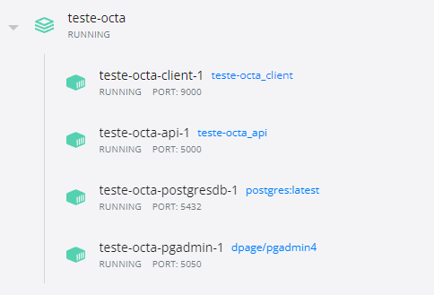
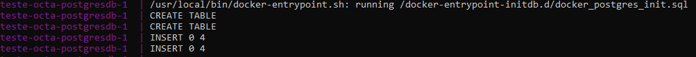

# Do que se trata este projeto?

Este projeto trata-se de um sistema básico de cadastro de duas entidades simples que condiz no registro de veículos e proprietários com informações básicas de cadastro. Ele foi estruturado de forma que consegue se adaptar facilmente à mudanças, principalmente a parte do BackEnd.
OCTA-teste é um projeto de modelo padrão para demonstrar a criação de um aplicativo Full Stack de vários contêineres com API Web ASP.NET Core (.NET 3.1) seguindo arquitetura limpa baseada no DDD e Angular 13. A solução usa o Docker Compose para orquestrar a implantação de toda essa pilha no Docker.

# O que a Solução oferece?

A solução é construída tendo em mente os blocos mais fundamentais que uma API deve ter para construir um componente de API escalável sem grandes dificuldades. A solução oferece uma implementação completa do seguinte:

- [x] Arquitetura limpa com camadas separadas para Application, Domain, Services e Infraestrutura.
- [x] UnitOfWork com repositório genérico
- [x] Entity Framework Core com Postgresql
- [x] CRUD completo para uma entidade seguindo o CQRS, com comandos e consultas segregados
- [x] Swagger UI pré-configurado
- [x] A configuração do Docker com Dockerfiles pronta para uso
- [x] Implementação completa do cliente da entidade CRUD em Angular
- [x] Implementação do AutoMapper para a conversão Entity-to-DTO
- [x] Deploy no Docker com apenas um comando com Docker Compose
- [x] Database Seeding utilizando configuração do Postgresql no Docker Compose
- [x] Fluent Validation dos dados de entrada dentro das classes Command 
- [x] Versionamento de API

O que ainda pode ser melhorado no futuro:
- [ ] Criação de services no Client.
- [ ] Validação dos dados de entrada no Client.
- [ ] Tratamento de mensagens de erro.
- [ ] Criação de paginação, ordenação e filtro nos endpoints da API.  

# Tecnologias utilizadas

* ASP.NET Core (.NET 3.1) Web API
* Entity Framework Core (EFCore 3.1.22)
* Entity Framework Core PostgreSQL (3.1.18)
* SwaggerUI
* AutoMapper
* Angular 13 (Client)
* Nginx (Servidor web para o client no Docker)
* Docker Compose

# O que é Docker Compose?

Docker-Compose é um arquivo de configuração que contém instruções para o Docker sobre como os serviços devem ser criados a partir dos respectivos Dockerfiles. Enquanto um Dockerfile visa criar e personalizar contêineres de aplicativos por meio de imagens e instruções básicas, o arquivo Docker-Compose funciona através do Dockerfile e ajuda os desenvolvedores na execução de contêineres docker com especificações complexas de tempo de execução, como portas, volumes e assim por diante.



# Como faço para começar a usar o Docker Compose?

Para começar, siga os passos abaixo:

1. Instalar .NET 6 SDK (Mesmo utilizando .NET 3.1 no Backend)
2. Instalar a última versão do NodeJS 
3. Instalar Docker Desktop (Windows) / Docker (Linux/Mac)
4. Clonar a solução para um diretório local
5. Na raiz do repositório é possível encontrar o arquivo docker-compose.yml
6. Execute o comando abaixo para compilar e executar a solução no Docker (requer uma instalação funcional do Docker)

```
> docker-compose build --force-rm --no-cache && docker-compose up
```

7. Quando os containers inicializarem com sucesso, navegue até http://localhost:9000

- Esse processo pode demorar um pouco, pois o Docker irá baixar as imagens do postgres e pgadmin do Docker Hub.

- O banco será preenchido com alguns dados iniciais apresentados no arquivo 'docker_postgres_init.sql'



# Usuário padrão:

As configurações do Docker Compose adiciona um usuário para o PgAdmin e você pode usar as credenciais abaixo para acessar o banco criado:

```
EmailAddress: pgadmin4@pgadmin.org; Password: admin1234
```
